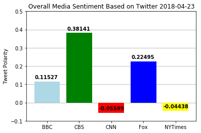

1. CBS had the most positive news according to the Vader Sentiment Analyzer.
2. CNN had the most negative twitter according Vader Sentiment Analyzer.
3. BBC had the most neutral twitter according to the Vader Sentiment Analyzer.


```python
# Dependencies
import tweepy
import numpy as np
import pandas as pd
import matplotlib.pyplot as plt
import datetime

from vaderSentiment.vaderSentiment import SentimentIntensityAnalyzer
analyzer = SentimentIntensityAnalyzer()

from config import (consumer_key, 
                    consumer_secret, 
                    access_token, 
                    access_token_secret)

auth = tweepy.OAuthHandler(consumer_key, consumer_secret)
auth.set_access_token(access_token, access_token_secret)
api = tweepy.API(auth, parser=tweepy.parsers.JSONParser())
```


```python
twitter_user = ("@BBC", "@CBS", "@CNN", "@Fox", "@nytimes")
sentiments =[]
username = None
oldest_tweet = None

for user in twitter_user:
    public_tweets = api.user_timeline(user, count=100)
    tweet_count = 1       
    for tweet in public_tweets:
        results = analyzer.polarity_scores(tweet["text"])
        compound = results["compound"]
        pos = results["pos"]
        neu = results["neu"]
        neg = results["neg"]
        tweets_ago = tweetnumber
        oldest_tweet = tweet['id'] - 1
        sentiments.append({"Username": user,
                           "Text":tweet["text"],
                           "Date": tweet["created_at"],
                           "Compound": compound,
                           "Positive": pos,
                           "Neutral": neu,
                           "Negative": neg,
                           "Tweet Count": tweet_count})
        
        if "Username" == "Username":
            tweet_count +=1
        else:
            tweet_count = 1  
```


```python
sentiments_df=pd.DataFrame.from_dict(sentiments)
sentiments_df = sentiments_df[["Username", "Tweet Count", "Date", "Compound", "Negative", "Neutral", "Positive", "Text"]]
sentiments_df["Username"] = sentiments_df["Username"].str.replace('@','')
sentiments_df.to_csv('News Mood Data.csv', index=False)
```


```python
sentiments_df.head()
```


<div>
<style scoped>
    .dataframe tbody tr th:only-of-type {
        vertical-align: middle;
    }

    .dataframe tbody tr th {
        vertical-align: top;
    }

    .dataframe thead th {
        text-align: right;
    }
</style>
<table border="1" class="dataframe">
  <thead>
    <tr style="text-align: right;">
      <th></th>
      <th>Username</th>
      <th>Tweet Count</th>
      <th>Date</th>
      <th>Compound</th>
      <th>Negative</th>
      <th>Neutral</th>
      <th>Positive</th>
      <th>Text</th>
    </tr>
  </thead>
  <tbody>
    <tr>
      <th>0</th>
      <td>BBC</td>
      <td>1</td>
      <td>Mon Apr 23 19:15:23 +0000 2018</td>
      <td>0.0</td>
      <td>0.0</td>
      <td>1.0</td>
      <td>0.0</td>
      <td>RT @BBCTwo: It's #ShakespearesBirthday so here...</td>
    </tr>
    <tr>
      <th>1</th>
      <td>BBC</td>
      <td>2</td>
      <td>Mon Apr 23 18:53:11 +0000 2018</td>
      <td>0.0</td>
      <td>0.0</td>
      <td>1.0</td>
      <td>0.0</td>
      <td>👶💖 The Duke and Duchess of Cambridge introduce...</td>
    </tr>
    <tr>
      <th>2</th>
      <td>BBC</td>
      <td>3</td>
      <td>Mon Apr 23 18:01:04 +0000 2018</td>
      <td>0.0</td>
      <td>0.0</td>
      <td>1.0</td>
      <td>0.0</td>
      <td>✈️ Do you know how to wear an oxygen mask?  ht...</td>
    </tr>
    <tr>
      <th>3</th>
      <td>BBC</td>
      <td>4</td>
      <td>Mon Apr 23 16:58:47 +0000 2018</td>
      <td>0.0</td>
      <td>0.0</td>
      <td>1.0</td>
      <td>0.0</td>
      <td>RT @BBCBreaking: The Duke and Duchess of Cambr...</td>
    </tr>
    <tr>
      <th>4</th>
      <td>BBC</td>
      <td>5</td>
      <td>Mon Apr 23 16:23:06 +0000 2018</td>
      <td>0.0</td>
      <td>0.0</td>
      <td>1.0</td>
      <td>0.0</td>
      <td>❤️ The Duke of Cambridge has arrived at hospit...</td>
    </tr>
  </tbody>
</table>
</div>


```python
bbc_df = sentiments_df.loc[sentiments_df["Username"] == "BBC"]
cbs_df = sentiments_df.loc[sentiments_df["Username"] == "CBS"]
cnn_df = sentiments_df.loc[sentiments_df["Username"] == "CNN"]
fox_df = sentiments_df.loc[sentiments_df["Username"] == "Fox"]
nytimes_df = sentiments_df.loc[sentiments_df["Username"] == "nytimes"]

compound_bbc = bbc_df["Compound"]
tweet_bbc = bbc_df["Tweet Count"]
compound_cbs = cbs_df["Compound"]
tweet_cbs = cbs_df["Tweet Count"]
compound_cnn = cnn_df["Compound"]
tweet_cnn = cnn_df["Tweet Count"]
compound_fox =fox_df["Compound"]
tweet_fox = fox_df["Tweet Count"]
compound_nytimes = nytimes_df["Compound"]
tweet_nytimes = nytimes_df["Tweet Count"]

fig = plt.figure(figsize=(9,8))

bbc_df = plt.scatter(tweet_bbc, compound_bbc, color="lightblue", s = 100, edgecolors="black", linewidths = .5, label = "BBC", alpha=0.75)
cbs_df = plt.scatter(tweet_cbs, compound_cbs, color="green", s = 100,linewidths = .5, edgecolors="black",label = "CBS", alpha=0.75)
cnn_df = plt.scatter(tweet_cnn, compound_cnn, color="red", s = 100,linewidths = .5, edgecolors="black",label = "CNN", alpha=0.75)
fox_df = plt.scatter(tweet_fox, compound_fox, color="blue", s = 100,linewidths = .5, edgecolors="black",label = "Fox", alpha=0.75)
nytimes_df = plt.scatter(tweet_nytimes, compound_nytimes, s = 100,color="yellow", linewidths = .5, edgecolors="black",label = "NYTimes", alpha=0.75)

plt.xlabel("Tweets Ago")
plt.ylabel("Tweet Polarity")
plt.title(f"Sentiment Analysis of Media Tweets " + (str(datetime.date.today())))
lgnd = plt.legend(bbox_to_anchor = (1,1), title = 'Twitter User') 
plt.grid()
plt.show
```


    <function matplotlib.pyplot.show>


```python
sentiments_groupby=sentiments_df.groupby("Username")["Compound"].mean().round(5)
labels = ("BBC", "CBS", "CNN", "Fox", "NYTimes")
colors = "lightblue", "green", "red", "blue", "yellow"
x_axis = np.arange(len(twitter_user))
plt.gca().yaxis.grid(True)
plt.bar(x_axis, sentiments_groupby, color=colors, align="edge", zorder=3)

tick_locations = [value+0.4 for value in x_axis]
plt.xticks(tick_locations, labels)
plt.ylim(-.1, .5)
y = sentiments_groupby
for i, v in enumerate(y):
    plt.text(i+.02, v+.015, str(v).format(), color='black', fontweight = 'bold')

plt.title("Overall Media Sentiment Based on Twitter " + (str(datetime.date.today())))

plt.ylabel("Tweet Polarity")

plt.gca().yaxis.grid(True)

plt.show
```


    <function matplotlib.pyplot.show>




